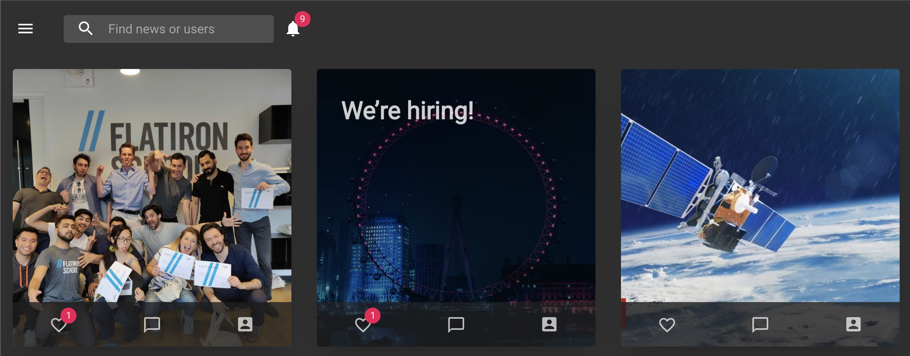
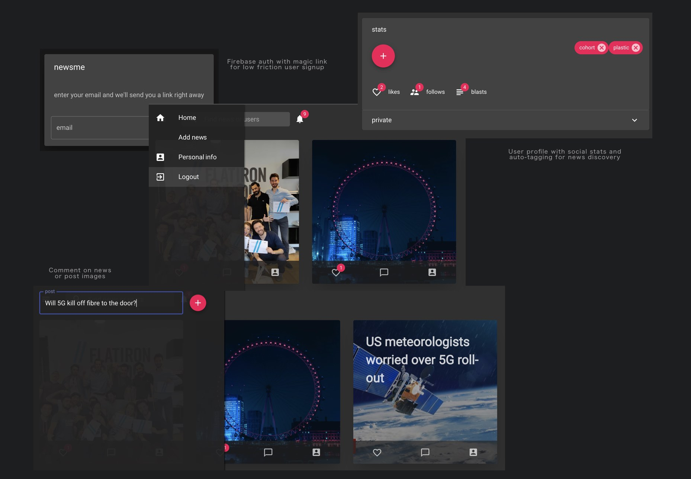

## newsme
Social news for busy pros, link to or be the news, prepare to be challenged.

- API built in Node, Express, and MongoDB
- WebApp designed with React, Material UI, and Firebase Auth
- Coded in ES6 using Babel
- Designed with Sketch

## Features

- Components in seperate files for readability and reusability
- Levereged power and efficiency of React Hooks
- Responsiveness and <em>accessibility</em> from Material UI
- MongoDB Node drivers for maximum performance
- Routing managed by Express
- APIs managed by Node = news scraping + auto tagging for thinner client
- User auth and image hosting managed by Google Firebase for stability and cost efficiency

## TODO

- Drier code (+custom hooks)
- Improve commenting throughout

### `npm start && nodemon server`

- Runs the app in development mode
- Opens [http://localhost:3000] in your default browser with Node hosted on post 3003
- The page will reload if you make edits
- You will also see any lint errors in the console
